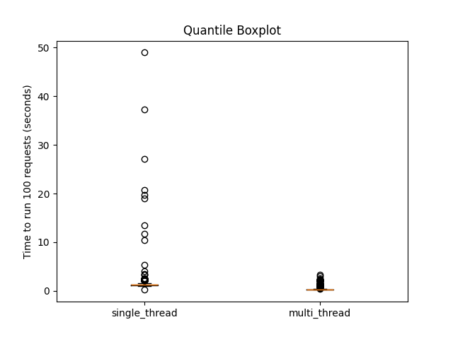
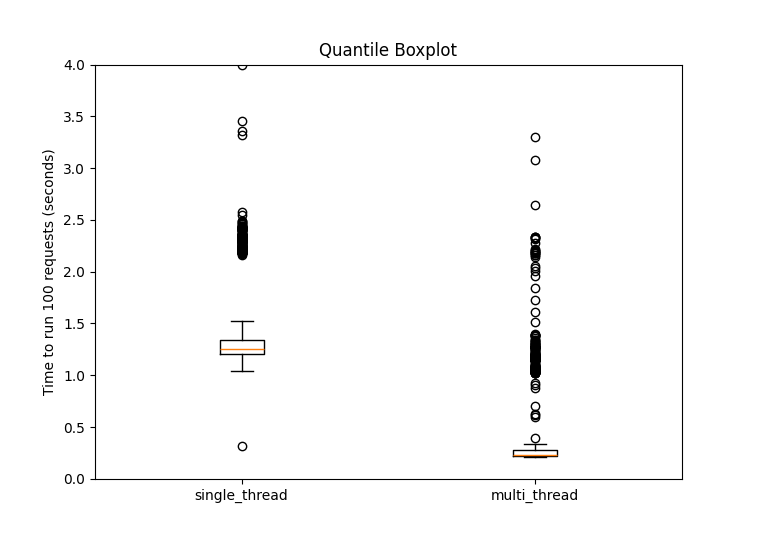

# Assignment 1 Multi-Threaded Web Server and Analysis  
## Par1: Simple Multi-Threaded Web Server  
This is a Python-based multi-threaded web server designed to serve files and directory listings. The server listens on a specified port and serves files from a specified directory. You can run it as a single-threaded or multi-threaded application, depending on your needs.  

### Usage   
Running the Server  
`python3 main.py <port> <path> [-m]`    
<port>: The port number on which the server should listen for incoming connections.
<path>: The path to the directory you want to serve.     
-m (optional): If you include this flag, the server will run in multi-threaded mode, allowing it to handle multiple client connections concurrently. If you omit this flag, it will run in single-threaded mode.    

**Example:**
`python3 main.py 8345 /path/to/serve -m`
This command will start the server on port 8080, serving files from the /path/to/serve directory, and it will run in multi-threaded mode.

## Part2: Analysis
The Following analysis is done using local computer.  
*Single Threaded Server:* Average time for 1000 requests: 1.6609736137390136 seconds  
*Multi Threaded Server:* Average time for 1000 requests: 0.47310795521736143 seconds  

There are 2 side-by-side boxplots constructed. The first one includes outliers and the other one considers points closer to means.   
As shown in the graphs, single threaded server has some requests scattering vertically from 10s to 50s. On the other hand, multi threaded server has no request exceeding 10s. Moreover, the average time for requests is 1.66s for single threaded, compared to only 0.47s for multi threaded

  

## Part3: System Test  
Makefile is availale for building and testing “Burn after reading” system.   
Run make in terminal to build the executable file (a1p3).    
Run ./a1p3 to run the test.   
Run make clean to clean up the process.  

